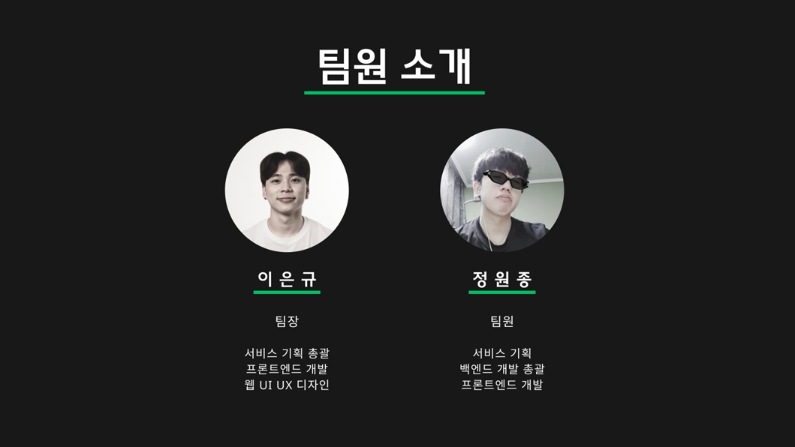
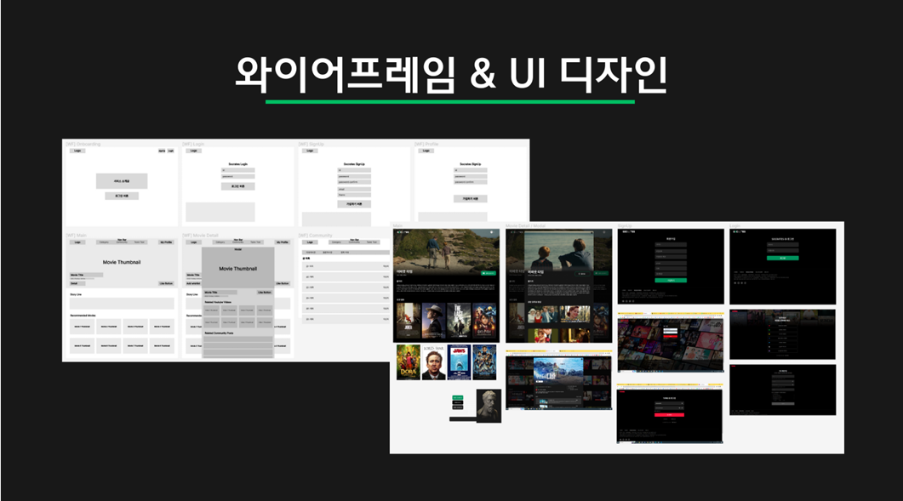

# Four Knights
👉 [GAME DOWNLOAD](https://www.4knights.co.kr/)</br>
👉 [GAME BUILD](https://drive.google.com/file/d/1qq7B22QTlkQIdM7Nag6u3Uq9VSMu39rh/view)</br> 
👉 [SOURCE CODE/ASSETS](https://drive.google.com/file/d/1jZvaquzq2abatI_Ial-WfpkSTaiy_QAx/view?usp=sharing/)</br>

## 목차
1. [개요](#Four-Knights)
2. [설계 문서](#설계-문서)
3. [개발 환경](#개발-환경)
4. [프로젝트 구조](#프로젝트-구조)
5. [팀원 소개](#팀원-소개)

## Four Knights
- 4가지의 직업 중 하나를 선택하여 사냥과 보스를 통해 재화를 얻고, 장비를 강화하며 성장하는 재미를 얻는다.
### 1.	사냥
- 솔로 플레이
- 핵 앤 슬래시
### 2.	레이드
- 멀티 플레이
- 1인 ~ 4인 파티 입장
### 3. 강화/승급
- 6개의 부위 강화 (투구, 갑옷, 장갑, 신발, 벨트, 무기)
- 10단계의 강화와 승급 시스템
### 4. 직업 4개
- 전사, 궁수, 마법사, 권사
### 5. 인게임
#### 1. 시작 화면 (서버 선택/캐릭터 선택)


#### 2. 마을 (시작하는 마을/잡화상점/장비강화)


#### 3. 파티 (생성/찾기/참여/입장)


#### 4. 보스 (골렘/드라이어드)


#### 5. 필드 (버려진 외곽/잃어버린 숲)


#### 6. 사망


#### 7. WEB


#### 8. WPF


## 설계 문서
- [컨벤션](https://nettle-donkey-951.notion.site/Convention-71dbb58adf8d46b09c421e2cde5d4e90?pvs=4)
- [기능/요구사항 명세서](https://nettle-donkey-951.notion.site/dc010b83176b43778419526911acd1e9?pvs=4)
- [ERD](https://nettle-donkey-951.notion.site/ERD-acbacd0e561b4f95a49cd70aa2b59b90?pvs=4)
- [API](https://nettle-donkey-951.notion.site/API-b7975c3500b1483a8fca51dbefbd8315?pvs=4)


## 개발 환경

#### Front-end
<br/>


<br/>

#### Back-end


#### Database

<br/>

#### Web
<br/>
<br/>

#### Management Tool
<br/>
<br/>
<br/>

## 프로젝트 구조
### [Front-end]
```
└─B208
    ├── Assets
    │   ├── 01.Scenes
    │   ├── 02.Scripts
    │   ├── 03.Prefabs
    │   ├── 04.Audio
    │   ├── 05.Font
    │   ├── 06.Sprites
    │   ├── 07.Animation
    │   ├── ExternalAssets
    │   ├── Materials
    │   ├── Photon
    │   ├── Plugins
    │   ├── Polygon Arsenal
    │   ├── Resources
    │   ├── Samples
    │   ├── Settings
    │   └── TextMesh Pro  
    ├── Library
    ├── Logs
    ├── Packages
    ├── ProjectSettings
    └── UserSettings
```

### [Back-end]
```
└─knight
    ├─.gradle  
    ├─.idea
    ├─build
    ├─gradle
    └─src
        ├─main
        │  ├─java
        │  │  └─b208
        │  │      └─knight
        │  │          ├─api
        │  │          │  ├─controller
        │  │          │  ├─dto
        │  │          │  │  ├─request
        │  │          │  │  └─response
        │  │          │  └─service
        │  │          ├─common
        │  │          │  ├─config
        │  │          │  ├─exception
        │  │          │  └─model
        │  │          │      └─response
        │  │          └─db
        │  │              ├─entity
        │  │              ├─join
        │  │              └─repository
        │  └─resources
        │      ├─static
        │      ├─templates
        │      └─application.properties
        └─test
            └─java
                └─b208
                    └─knight
```

## 팀원 
### 소개


### 역할
#### 이은규 (팀장)

- 와이어 프레임 & UI 디자인 담당 <br>
  
- 발표 자료 제작

#### 정원종 (팀원)
