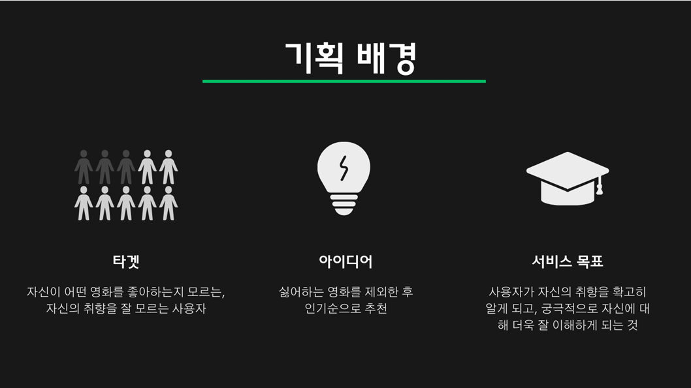
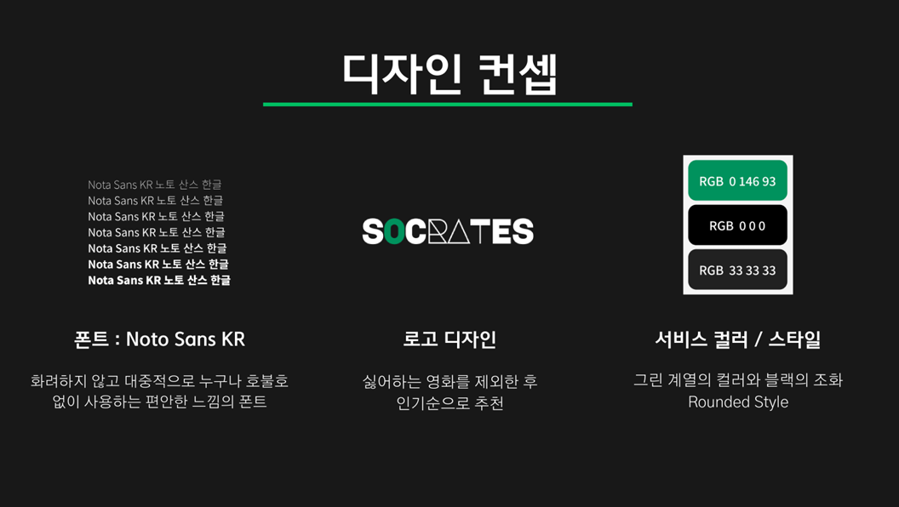
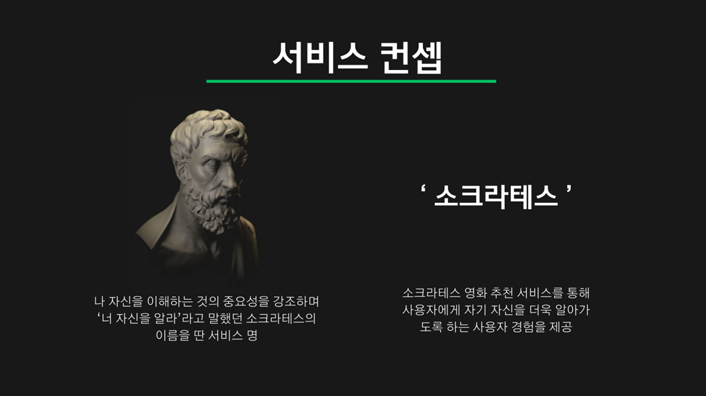
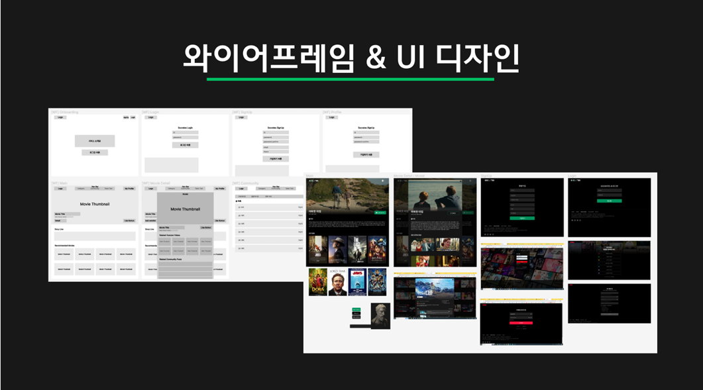
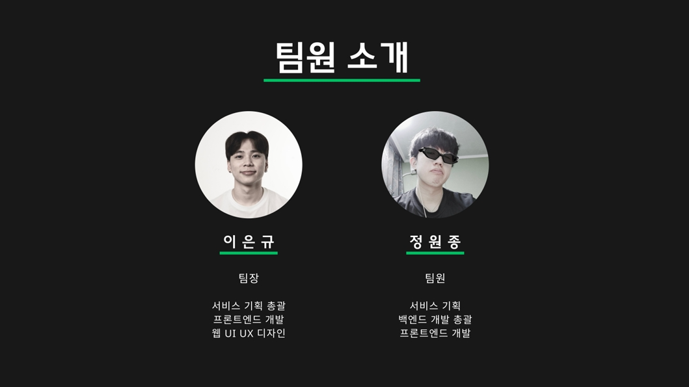

# Socrates

<br>



## 목차
1. [개요](#Socrates)
2. [설계 문서](#설계-문서)
3. [개발 환경](#개발-환경)
4. [프로젝트 구조](#프로젝트-구조)
5. [팀원 소개](#팀원-소개)

## Socrates
### 슬로건: “너 자신을 알라”
- 자신이 좋아하는 영화를 잘 모르는 사람들을 위한 영화 추천 서비스.<br>
- 사용자가 '싫어하는 장르'를 선택하면, 해당 장르를 제외한 영화들만 추천해주는 역방향 추천 알고리즘 기반의 영화 추천 사이트입니다.<br>

### 🔍 타겟 사용자
- 보고 싶은 영화를 명확히 정하지 못한 사용자

- 취향을 알아가고 싶은 사용자

- 함께 영화를 고르기 어려운 친구, 가족, 커플

### 🔥 핵심 기능  
1. **회원가입 시 싫어하는 장르 설정 → 해당 장르 제외 추천**  
2. **로그인한 유저의 싫어하는 장르 수정 가능 (마이페이지)**  
3. **실시간 영화 검색 및 상세 정보 조회**  
4. **영화 커뮤니티 기능 (자유글, 질문, 리뷰 게시판)**  

### 🧠 추천 알고리즘  
- 사용자가 지정한 `hate_genres` 정보를 기반으로 해당 장르를 포함한 영화를 필터링하여 제외 추천  
- 영화 평점 데이터를 기반으로 한 향후 확장 계획 포함  

<!-- ## 설계 문서
- [기획서 및 요구사항 정리](https://nettle-donkey-951.notion.site/dc010b83176b43778419526911acd1e9?pvs=4)  
- [ERD 모델링](https://nettle-donkey-951.notion.site/ERD-acbacd0e561b4f95a49cd70aa2b59b90?pvs=4)  
- [API 명세서](https://nettle-donkey-951.notion.site/API-b7975c3500b1483a8fca51dbefbd8315?pvs=4)  
- [작업 일정표 (Trello)](./img/trello%20할일%20목록.PNG)   -->

## 개발 환경
### 🧩 Front-end  
- **프레임워크**: Vue.js  
- **상태 관리**: Pinia  
- **요청 처리**: Axios  
- **템플릿 엔진**: Vue CLI  
- **개발 툴**: Visual Studio Code  

### 🧩 Back-end  
- **프레임워크**: Django  
- **API 라이브러리**: Django REST Framework, dj-rest-auth  
- **DB 연동**: SQLite3  
- **파일 업로드**: Django ImageField  

### Management Tool
<br/>
<br/>
<br/>

## 프로젝트 구조
### [Front-end]
```
src/
  ├── components/
  │    ├── accounts/AuthForm.vue
  │    ├── community/...
  │    └── main/MovieDetail.vue
  ├── views/
  │    ├── accounts/ProfilePage.vue
  │    ├── community/PostDetailView.vue
  │    └── main/MainView.vue
  ├── stores/
  │    ├── auth.js
  │    ├── movie.js
  │    ├── posts.js
  │    └── comments.js
  └── router/index.js
```

### [Back-end]
```
socrates/
  ├── accounts/
  │    ├── models.py
  │    ├── serializers.py
  │    ├── views.py
  │    └── urls.py
  ├── movies/
  │    ├── models.py
  │    ├── views.py
  │    ├── fixtures/
  │    │    ├── movies.json
  │    │    └── genres.json
  └── community/
       └── ...
```

## 팀원 
### 소개


### 역할
#### 이은규 (팀장)
- 프론트엔드 개발 / 서비스 기획
- 와이어 프레임 & UI 디자인 담당 <br>
- 발표 자료 제작

#### 정원종 (팀원)
- 백엔드 개발 / API 설계 / 프론트 일부 구현

## 후기 및 느낀점
### 🔥 이은규
처음으로 프론트와 백엔드를 명확히 나누어 프로젝트를 진행해봤다. 업무 분담이 명확해서 집중은 잘 됐지만 서로 영역에 대해 모르는 부분이 많아 문제 해결이 느려질 때도 있었다. 그래도 싫어하는 장르를 제외한 영화 추천이라는 독특한 방향성을 시도해본 점이 의미 있었다.

### 🌱 정원종
추천 알고리즘보다 가장 어려웠던 건 Data Table과 모델 설계였다. JSON 기반의 데이터 임포트나 ManyToManyField 관계를 통해 사용자 선호도를 어떻게 반영할지 고민이 많았다. 실제로 ORM을 쓰지 못하고 JSON으로 돌아가기도 했지만 그 과정 자체가 많이 배웠던 시간이었다.