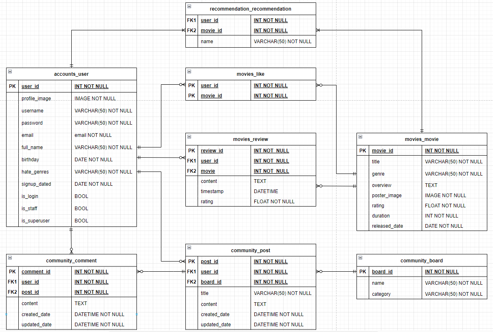

# 초기 기획
- 제공하는 서비스
    - 서비스 명 : Socrates
        - 이유 : "너 자신을 알라" 라고 말한 소크라테스의 이념을 적용
            => 자신이 어떤 영화를 좋아하는지 모르는 사람들로 하여금 자신이 어떤 영화를 좋아하는지 알게되고, 
            그걸로 인해 자기 자신을 더욱 이해하고 알게 만들어주는 서비스를 제공하고자 이름을 붙임

    - 타겟
        - 본인이 무슨 영화를 좋아하는지 몰라서 추천받고 싶은 사람
        -  보고싶은 영화를 명확히 정하지않고 들어오는 사람

    - 서비스의 목표
        - 무슨 영화를 좋아하는지 모르는 사람이 어떤 영화 장르를 좋아하는 지 알게해주자.
        - 그리고 그 좋아하는 영화의 장르를 기반으로 추천해주자.

    - 방법
        - 회원가입 할 때 유저가 싫어하는 유형의 장르를 배제하는 알고리즘
            -> 프로필에서 수정가능
        - 영화에 평점을 남겨서 그 평점을 기반으로 영화를 추천

# 서비스에 대한 기술적 설명

- 구현 하고자 하는 서비스
    - 필수적
        - 회원가입 할 때 유저가 싫어하는 유형의 장르를 배제하는 알고리즘
        - 영화에 평점을 남겨서 그 평점을 기반으로 영화를 추천

    - 선택적
        - 타겟층에 따라서 들어가는 페이지를 다르게 하기
        - 모드 바꾸기(다크모드, 화이트모드)

# ERD

 

# 후기 (완료시간 : )

1. 

2. 

3. 

4. 

## 느낀점